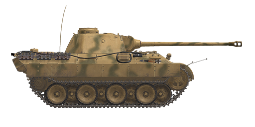

# Pz.Kpfw.V Ausf.D

## Description

Developed by MAN company in 1942, it first saw action in the Kursk battle in 1943. The tank had a powerful main gun, thick frontal armor and good mobility at the price of protection from other sides.  
  
For the better distribution of weight and protecting the sides, its wheels were positioned in a checkerboard order, making the running gear repairs very difficult - in combat conditions its damage often led to a loss of tank. The compression stroke of the suspension was very large and it was significantly softer than on other tanks, resulting in traveling comfort. One suspension unit included two torsion bars (32 bars in total). The reliability of these machines, especially at the beginning of their production, was abysmal - only 4 of 174 were sent to the front line units by April 1943, the others were returned to the factories of origin for reworking.  
  
The main gun 75 mm KwK 42 had a high muzzle velocity and could penetrate the armor of any enemy tank at significant distances.  
  
The frontal armor protection was good, but the sides, rear and especially the bottom and roof armor of the tank was poor and provided inadequate protection from enemy tanks and guns. To improve the weak side protection, additional thin armor sheets (Schürzen) were installed.  
  
Ausführung D modification was in production from January till September 1943 with a total of 842 units made.  
  
<b><u>Unladen weight:</u></b> 45500 kg.  
Length: 8.9 m.  
Width: 3.4 m.  
Height: 3.0 m.  
Clearance: 550 mm.  
  
Engine Maybach HL 210 P30 (petrol).  
Maximum power: 650 HP at 3000 RPM.  
Maximum RPM: 3000 RPM.  
7 speeds gearbox.  
  
<b><u>Maximum road speed:</u></b>  
1-st: 4.2 kph.  
2-st: 8.4 kph.  
3-st: 13.2 kph.  
4-st: 21.6 kph.  
5-st: 30.0 kph.  
6-st: 42.0 kph.  
7-st: 55.2 kph.  
Reverse: 4.1 kph.  
  
<b><u>Maximum offroad speed:</u></b> 25 kph.  
  
<b><u>Fluids:</u></b>  
Internal fuel tanks capacity: 720 l.  
Engine oil system capacity: 42 l.  
Summer engine coolant: 120 l. of 40%25 glysantin  
Winter engine coolant: 120 l. of 60%25 glysantin  
Endurance range: 205 km.  
Maximum oil consumption: 3.8 l/h.  
  
<b><u>Hull armour:</u></b>  
Upper front: 80 mm rolled armour.  
Lower front: 60 mm rolled armour.  
Sides: 40 mm rolled armour.  
Rear: 40 mm rolled armour.  
Roof: 16 mm rolled armour.  
Roof grates: 20 mm cast armour.  
Bottom: 16 mm rolled armour.  
Bottom above tracks: 16 mm rolled armour.  
  
<b><u>Turret armour:</u></b>  
Front: 100 mm cast armour.  
Sides: 45 mm rolled armour.  
Rear: 45 mm rolled armour.  
Roof: 16 mm rolled armour.  
Cupola: 95 mm cast armour.  
Gun mantlet: 100 mm cast armour.  
  
<b><u>Main gun:</u></b> rifled, 7,5 cm KwK 42 L/70.  
Barrel length: 58.1.  
Elevation: +18°..-8°.  
Ammo: up to 79 rounds.  
Usable rate of fire: 7 rounds per minute.  
Turret drive: hydraulic, 60 seconds per rotation.  
  
<b><u>Gun ammunition:</u></b>  
7,5 cm Pzgr. 39/42 armour piercing high explosive (APHE): 6.8 kg, 925 m/s, 140 mm at 500 m.  
7,5 cm Pzgr. 40/42 armour piercing composite rigid (APCR): 4.1 kg, 1170 m/s, 208 mm point blank.  
7,5 cm Sprgr.42 high explosive (HE): 5.74 kg, 700 m/s, 660 g explosives.  
  
<b><u>Machineguns:</u></b> 7.92 mm Maschinengewehr MG 34.  
Bullet mass: 11.5 g.  
Muzzle velocity: 855 m/s.  
Armour penetration at 100 m: 11 mm.  
Rate of fire: 900 rounds per minute.  
Coaxial: 20 belts, 150 rounds per belt (3000 rounds).  
Bow: +-15°/+13°..-6°, 42 magazines, 50 rounds per magazine (2100 rounds).  
  
<b><u>Gunsights:</u></b>  
Tzf 12 gunner binocular scope-sight, field of view 29°.  
  
<b><u>Radio equipment:</u></b>  
VHF Fu 5 transceiver with additional Fu 2 receiver.  
4 intercom terminals.

## Modifications

**High-Explosive Shells**  
7,5 cm SprGr.42  
  
Good against soft, unarmored or lightly armored targets.  
  
Mass 5.74 kg, explosives mass 660 g.  
  
Direct hit armour penetration 20 mm, effective damage distance for light vehicles 3 m.  
  
When fired from a 7,5 cm KwK 42 L/70 gun:  
Muzzle velocity 700 m/s.  
500 m: velocity 648 m/s, drop -2.8 m.  
1000 m: velocity 601 m/s, drop -11.5 m.  
2000 m: velocity 518 m/s, drop -49.9 m.

**Armour Piercing High Explosive Shells**  
7,5 cm Pzgr. 39/42  
  
Shells armed with bursting charge warhead.  
  
Good against armoured targets. In case of penetration do more damage inside the target than solid AP shells, but HE filling can detonate prematurely (for instance, when used against spaced armour plates).  
  
Mass 6.8 kg, explosives mass 18 g.  
  
When fired from a 7.5 cm KwK 42 L/70 gun:  
Muzzle velocity 925 m/s, armour penetration at point blank range 158 mm.  
500 m: armour penetration 140 mm, velocity 825 m/s, drop -1.6 m.  
1000 m: armour penetration 125 mm, velocity 785 m/s, drop -6.6 m.  
2000 m: armour penetration 99 mm, velocity 667 m/s, drop -29.6 m.

**Removed additional armor plates**  
Removed 5 mm Schürzen that were attached to the hull. They were added mainly to protect the tank from massed AT rifle fire which was dangerous for thinner armored sides. Not being able to stop an AP bullet, this additional armor destabilized it or caused its fragmentation before it could hit the main armored hull.

**Sub-Caliber Armour Piercing Shells**  
7,5 cm Pzgr. 40/42  
  
Shells armed with sub-caliber armour-piercing projectile. Good against heavily armoured targets at short ranges.  
  
7,5 cm Pzgr. 40 is a composite round - hard (tungsten alloy) penetrator inside a body made from a softer steel (for obturation inside a gun barrel).  
  
Mass: 4.1 kg, penetrator calibre 28 mm.  
  
When fired from a KwK 42 L/70 gun:  
Muzzle velocity 1170 m/s, armour penetration at point blank range 208 mm.  
500 m: armour penetration 179 mm, velocity 1054 m/s, drop -1.0 m.  
1000 m: armour penetration 154 mm, velocity: 949 m/s, drop -4.3 m.  
2000 m: armour penetration 111 mm, velocity: 756 m/s, drop -19.7 m.
