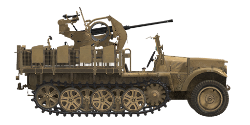

# Sd.Kfz.10/5

## Description

One of the many Sd.Kfz.10 half-track modifications produced by Demag company as mobile Flak 38 anti-air gun platform since 1939.  
  
This fully metallic integral body half-track was propelled by a double differential tracked chassis with brakes (forward steering wheels don\'t have brakes) and had a custom metallic platform where the gun was installed.  
  
20mm Flak 38 anti-air gun was a modification of the earlier Flak 30 design with doubled rate of fire and improved two-speed lateral and vertical aiming system, its production started in 1938.  
  
<b><u>Unladen weight:</u></b> ~4900 kg.  
Length: 4.8 m.  
Width: 2.4 m.  
Height: 2.4 m.  
Clearance: 310 mm.  
  
Engine: Maybach HL42 TRKM, petrol.  
Maximum power: 100 HP at 2800 RPM.  
Maximum RPM: 3000 RPM.  
7 speed gearbox.  
  
<b><u>Maximum road speed:</u></b>  
1st: 5.9 kph.  
2nd: 9.6 kph.  
3rd: 13.9 kph.  
4th: 21.4 kph.  
5th: 33.2 kph.  
6th: 51.4 kph.  
7th: 69.6 kph.  
Reverse 1st: 5.9 kph.  
Reverse 2nd: 9.6 kph.  
Reverse 3rd: 13.9 kph.  
  
<b><u>Maximum offroad speed:</u></b> 25 kph.  
  
<b><u>Fluids:</u></b>  
Internal fuel tanks capacity: 90 l.  
Engine oil system capacity: 12 l.  
Engine coolant: 18 l. of water  
Endurance range: 260 km.  
Maximum oil consumption: 1 l/h.  
  
<b><u>Optional armour shield:</u></b>  
6 mm rolled armour.  
  
<b><u>Main gun:</u></b> rifled, 20 mm Flak 38.  
Barrel length: 65.  
Elevation: +85°..-12°.  
Ammo: up to 280 rounds (14 clips, 20 rounds per clip).  
Rate of fire: 450 rounds per minute.  
Turret drive: mechanical, 6 seconds per rotation.  
  
<b><u>Ammunition: </u></b>  
2 cm Pzgr. L\'spur armour piercing solid (AP): 148 g, 780 m/s, 33 mm at 500 m.  
2 cm Spgr.Patr. high explosive (HE): 115 g, 880 m/s, 6 g explosives.  
  
<b><u>Gunsights:</u></b>  
Schwebekreis Visier 38 mechanical AA gunsight.  
ZF 3x8 telescopic gunsight for engaging ground targets.  
Reserve iron sights.

## Modifications

**High-Explosive Shells**  
2 cm Spgr.Patr.  
  
Good against soft, unarmoured or lightly armoured targets.  
  
Mass 115 g, explosives mass 6 g.  
Self-destroying (they explode after 6 seconds at roughly 2000 m range).  
Direct hit armour penetration 3 mm, effective damage distance for light vehicles 1 m.  
  
When fired from a Flak 38 gun:  
Muzzle velocity: 880 m/s.  
500 m: velocity 634 m/s, drop -2.1 m.  
1000 m: velocity 373 m/s, drop -11.0 m.  
2000 m: velocity 245 m/s, drop -95.8 m.

**Armour Piercing Shells**  
2 cm Pzgr. L'spur  
  
Solid armour piercing shells without explosive filling.  
Good against spaced armour plates, but cause less damage inside a target than more advanced APHE.  
  
Mass: 148 g.  
  
When fired from a Flak 38 gun:  
Muzzle velocity 780 m/s, armour penetration at point blank range 25 mm.  
500 m: armour penetration 16 mm, velocity 561 m/s, drop -2.7 m.  
1000 m: armour penetration 9 mm, velocity 393 m/s, drop -13.6 m.  
2000 m: armour penetration 5 mm, velocity 264 m/s, drop -96.1 m.

**Remove gunsight shield**  
Removing the gunsight shield gives the gunner a slightly wider field of view.

**Remove both gun shields**  
Gun shields are completely removed for an improved field of view.
