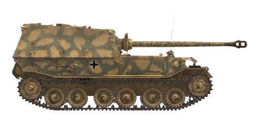

# Sd.Kfz.184

## Description

Heavy tank destroyer Sd.Kfz.184 built at Nibelungenwerke in 1943. This early version lacking commander cupola and a machine gun is known as "Ferdinand", while a later one equipped with these is known as "Elefant". 91 vehicles of all modifications were produced in total.  
  
This self-propelled artillery was created to make use of the numerous "Tiger (P)" tanks chassis that were built for a new German heavy tank, but were left unused when the German authorities chose a competing design. This chassis had a unique electromechanical transmission, which, while being cutting-edge for its time, had many disadvantages - a significant drop in efficiency as the speed increased was the main one. This led to a very limited operational range and driving speed. However, "Ferdinand" was the most armored combat vehicle at the time of the Kursk battle. Its only weapon was long 88mm KwK 43 main gun designed on the basis of Flak 41 AA gun - its muzzle energy was more than 1.5 times higher than the muzzle energy of KwK 39 installed on Tiger tanks. As a result, armor-piercing rounds fired from it could knock out any armored vehicle of its time at any distance up to the maximum aiming distance. The early production vehicles had serious problems with the field of vision: the gunner used a periscopic gunsight with a very limited field of view while the commander had no optical visors usable with a closed hatch. Two loaders had periscopes for looking backward (in the game they can be used by the gunner and commander).  
  
At the Kursk battle, Sd.Kfz.184 was the most armored combat vehicle armed with the best anti-tank weapon, but they failed to make a decisive impact on the battle outcome because their numbers and mobility were limited.  
  
<b><u>Unladen weight:</u></b> 67000 kg.  
Length: 8.2 m.  
Width: 3.4 m.  
Height: 3.0 m.  
Clearance: 479 mm.  
  
Engine: 2 x Maybach HL 120TRM, petrol.  
Maximum power: 2 x 300 HP at 3000 RPM.  
Maximum RPM: 3000 RPM.  
Electromechanical transmission including two 250 kW DC traction generators, each attached to it's own engine. Generators are powering the joint powerline which feeds two DC driving motors - one per side.  
Powerplant has 3 power modes:  
1st: beginning of the movement, low-speed turns and driving on stiff slopes.  
2nd: acceleration and driving on difficult terrain.  
3rd: general driving mode.  
  
<b><u>Maximum allowed road speed:</u></b> 20 kph.  
  
<b><u>Maximum offroad speed:</u></b> 11 kph.  
  
<b><u>Endurance range:</u></b> 150 km.  
  
<b><u>Fluids:</u></b>  
Internal fuel tanks capacity: 950 l.  
Engine oil system capacity: 50 l.  
Summer engine coolant: 200 l. of 40% glysantin  
Winter engine coolant: 200 l. of 60% glysantin  
Maximum oil consumption: 22 l/h.  
  
<b><u>Hull armour:</u></b>  
Gun mantlet: 100 mm cast armour + 30 mm rolled armour screen.  
Cabin front: 100 mm + 100 mm rolled armour.  
Hull front: 100 mm + 100 mm rolled armour.  
Upper sides: 80 mm rolled armour.  
Lower sides: 60 mm rolled armour.  
Rear: 60 mm rolled armour.  
Rear, armouring of cooling exhaust of electromotors: 45 mm rolled armour.  
Frontal roof: 30 mm rolled armour.  
Rear roof: 30 mm rolled armour.  
Bottom, forward: 50 mm rolled armour.  
Bottom, rear: 25 mm rolled armour.  
Bottom above tracks: 25 mm rolled armour.  
  
<b><u>Main gun:</u></b> rifled, 8,8 cm KwK 43 L/71.  
Barrel length: 58.5.  
Elevation: +15°..-7.5°.  
Azimuth: +12°..-12°.  
Ammo: up to 50 rounds.  
Usable rate of fire: 6 rounds per minute.  
Turret drive: mechanical.  
  
<b><u>Gun ammunition:</u></b>  
8,8 cm Pzgr. 39/43 armour piercing high explosive (APHE): 10.16 kg, 1000 m/s, 179 mm at 500 m.  
8,8 cm Pzgr. 40/43 armour piercing composite rigid (APCR): 7.3 kg, 1130 m/s, 266 mm point blank.  
8,8 cm Sprgr. Flak 41 high explosive (HE): 9.4 kg, 700 m/s, 1 kg explosives.  
  
<b><u>Gunsight settings for Sprgr. Flak 41:</u></b>  
(Distance - point number of upper scale):  
0000m - 000  
0100m - 001    4100m - 060    8100m - 182  
0200m - 002    4200m - 062    8200m - 186  
0300m - 003    4300m - 064    8300m - 190  
0400m - 004    4400m - 066    8400m - 195  
0500m - 005    4500m - 068    8500m - 200  
0600m - 006    4600m - 070    8600m - 205  
0700m - 008    4700m - 072    8700m - 210  
0800m - 009    4800m - 075    8800m - 215  
0900m - 010    4900m - 077    8900m - 220  
1000m - 011    5000m - 080    9000m - 225  
  
1100m - 012    5100m - 082    9100m - 231  
1200m - 014    5200m - 084    9200m - 236  
1300m - 015    5300m - 087    9300m - 241  
1400m - 016    5400m - 090    9400m - 247  
1500m - 017    5500m - 092    9500m - 253  
1600m - 019    5600m - 095    9600m - 259  
1700m - 020    5700m - 097    9700m - 265  
1800m - 021    5800m - 100    9800m - 271  
1900m - 023    5900m - 103    9900m - 277  
2000m - 024    6000m - 106   10000m - 284  
  
2100m - 025    6100m - 109   10100m - 290  
2200m - 027    6200m - 112   10200m - 297  
2300m - 028    6300m - 115   10300m - 303  
2400m - 030    6400m - 118   10400m - 311  
2500m - 031    6500m - 121   10500m - 318  
2600m - 033    6600m - 124  
2700m - 034    6700m - 127  
2800m - 036    6800m - 131  
2900m - 038    6900m - 134  
3000m - 039    7000m - 138  
  
3100m - 041    7100m - 142  
3200m - 043    7200m - 145  
3300m - 045    7300m - 149  
3400m - 046    7400m - 153  
3500m - 048    7500m - 157  
3600m - 050    7600m - 161  
3700m - 052    7700m - 165  
3800m - 054    7800m - 169  
3900m - 056    7900m - 173  
4000m - 058    8000m - 177  
  
<b><u>Gunsights:</u></b>  
Sfl ZF 1a gunner periscopic sight, field of view 8°.  
  
<b><u>Radio equipment:</u></b>  
VHF Fu 5 transceiver.  
5 intercom terminals.

## Modifications

**High-Explosive Shells**  
8,8 cm Sprgr. Flak 41  
  
Good against soft, unarmored or lightly armored targets.  
  
Mass 9.4 kg, explosives mass 1 kg.  
  
Direct hit armour penetration 24 mm, effective damage distance for light vehicles 3 m.  
  
When fired from a 8,8 cm KwK 43 L/71 gun:  
Muzzle velocity 700 m/s.  
500 m: velocity 662 m/s, drop -2.7 m.  
1000 m: velocity 625 m/s, drop -11.1 m.  
2000 m: velocity 556 m/s, drop -47.4 m.

**Reversed gun mantlet shield**  
Gun mantlet shield installed hind-foremost for easier access to the bolts holding the halves of the shield together (cosmetic change).

**Armour Piercing High Explosive Shells**  
8,8 cm Pzgr. 39/43  
  
Shells armed with bursting charge warhead.  
  
Good against armoured targets. In case of penetration do more damage inside the target than solid AP shells, but HE filling can detonate prematurely (for instance, when used against spaced armour plates).  
  
Mass 10.16 kg, explosives mass 64 g.  
  
When fired from a 8,8 cm KwK 43 L/71 gun:  
Muzzle velocity 1000 m/s, armour penetration at point blank range 192 mm.  
500 m: armour penetration 179 mm, velocity 951 m/s, drop -1.3 m.  
1000 m: armour penetration 167 mm, velocity 905 m/s, drop -5.4 m.  
2000 m: armour penetration 144 mm, velocity 816 m/s, drop -22.8 m.

**Sub-Caliber Armour Piercing Shells**  
8,8 cm Pzgr. 40/43  
  
Shells armed with sub-caliber armour-piercing projectile. Good against heavily armoured targets at short ranges.  
  
8,8 cm Pzgr. 40 is a composite round - hard (tungsten alloy) penetrator inside a body made from a softer steel (for obturation inside a gun barrel).  
  
Mass: 7,3 kg, penetrator calibre 37 mm.  
  
When fired from a 8,8 cm KwK 43 L/71 gun:  
Muzzle velocity 1130 m/s, armour penetration at point blank range 266 mm.  
500 m: armour penetration 237 mm, velocity 1044 m/s, drop -1.1 m.  
1000 m: armour penetration 212 mm, velocity: 964 m/s, drop -4.6 m.  
2000 m: armour penetration 168 mm, velocity: 821 m/s, drop -19.7 m.
