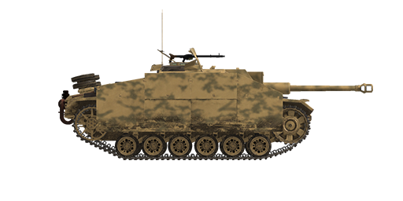

# StuG III Ausf.G

## Description

This self-propelled assault gun Sturmgeschütz III Ausführung G was armed with 75 mm StuK 40 L/48 gun. Ausf.G was one of the last modifications, but the most numerous: 7800 SPG in total since December 1942 till April 1945. Compared to the previous one, it had a longer gun barrel (L/48 instead of L/43) and additional armour sheets installed in the hull and cabin front. The SPG modeled in our sim was built at MIAG factory using the Pz.Kpfw. Ausf.M chassis produced by MAN factory.  
  
The most apparent visual difference was the addition of side armor plates, "Schürzen", which were attached to the hull sides. They were added mainly to protect the tank from massed AT rifle fire which was dangerous for thinner armored sides. Not being able to stop an AP bullet, this additional armour destabilized it or caused its fragmentation before it could hit the main armored hull.  
  
The long-barrelled 75 mm gun can reliably engage Soviet tanks at distances up to 1 km. However, the artillery periscopic gunsight was less convenient for quick direct firing than telescopic gunsights installed on tanks.  
  
Late StuG III modifications were equipped by infantry MG34 machinegun stored in the fighting compartment. To fire it, the loader had to get out of his hatch, raise the armored shield and set the machinegun up in one of the two positions - for firing at air or ground targets. Six one-shot smoke mortars could be also installed.  
  
<b><u>Unladen weight:</u></b> 23300 kg.  
Length: 6.3 m.  
Width: 3.29 m.  
Height: 2.2 m.  
Clearance: 385 mm.  
  
Engine: Maybach HL 120TRM, petrol.  
Maximum power: 300 HP at 3000 RPM.  
Maximum RPM: 3000 RPM.  
6 speed gearbox.  
  
<b><u>Maximum road speed:</u></b>  
1-st: 4.8 kph.  
2-nd: 9.2 kph.  
3-rd: 15.5 kph.  
4-th: 23.5 kph.  
5-th: 33.2 kph.  
6-th: 42.8 kph.  
Reverse: 5.9 kph.  
  
<b><u>Maximum offroad speed:</u></b> 18 kph.  
  
<b><u>Fluids:</u></b>  
Internal fuel tanks capacity: 320 l.  
Engine oil system capacity: 25 l.  
Summer engine coolant: 100 l. of 40%25 glysantin  
Winter engine coolant: 100 l. of 60%25 glysantin  
Endurance range: 155 km.  
Maximum oil consumption: 2 l/h.  
  
<b><u>Armour:</u></b>  
Gun mantlet: 50mm rolled armour.  
Cabin front, middle: 30mm rolled armour.  
Cabin front, lower: 50мм + 30mm rolled armour.  
Hull front, upper: 30 mm rolled armour.  
Hull front, middle: 50 mm rolled armour.  
Hull front, lower: 50 мм + 30 mm rolled armour.  
Hull front, bottom: 30 mm rolled armour.  
Cabin rear: 30 mm rolled armour.  
Hull rear, upper: 30 mm rolled armour.  
Hull rear, middle: 50 mm rolled armour.  
Hull rear, lower: 30 mm rolled armour.  
Cabin roof: 10 mm rolled armour.  
Cabin rear: 15 mm rolled armour.  
Sides: 30 mm rolled armour.  
Bottom: 15 mm rolled armour.  
  
<b><u>Additional armor sheets:</u></b>  
5 mm rolled armor for additional protection against AT rifles.  
  
<b><u>Main gun:</u></b> rifled, 7,5 cm Stu K 40 L/48.  
Barrel length: 55  
Elevation: +17°..-8°  
Azimuth: +10°..-10°.  
Ammo: up to 54 rounds  
Usable rate of fire: 10 rounds per minute.  
Turret drive: mechanical.  
  
<b><u>Gun ammunition:</u></b>  
7.5 cm Pzgr. 39 armor piercing high explosive (APHE): 6.8 kg, 750 m/s, 104 mm at 500 m.  
7.5 cm Pzgr. 40 armor piercing composite rigid (APCR): 4.1 kg, 930 m/s, 150 mm point blank.  
7.5 cm Gr.38 HL/С high explosive anti-tank (HEAT): 4.57 kg, 450 m/s, 104 mm.  
7.5 cm SprGr.34 high explosive (HE): 5.74 kg, 550 m/s, 660 g. explosives.  
  
<b><u>Machineguns:</u></b> 7.92 mm Maschinengewehr 34.  
Bullet mass: 11.5 g.  
Muzzle velocity: 855 m/s.  
Armour pentration at 100 m: 11 mm.  
Rate of fire: 900 rounds per minute.  
12 magazines, 50 rounds per magazine (60 rounds).  
  
<b><u>Gunsights:</u></b>  
Sfl ZF 1a gunner periscopic sight, field of view 8°.  
  
<b><u>Radio equipment:</u></b>  
VHF Fu 5 transceiver with additional Fu 2 receiver.  
4 intercom terminals.

## Modifications

**High-Explosive Shells**  
7,5 cm SprGr.34  
  
Good against soft, unarmored or lightly armored targets.  
  
Mass 5.74 kg, explosives mass 660 g.  
  
Direct hit armour penetration 20 mm, effective damage distance for light vehicles 3 m.  
  
When fired from a 7,5 cm Stu K 40 L/48 gun:  
Muzzle velocity 550 m/s.  
500 m: velocity 509 m/s, drop -4.5 m.  
1000 m: velocity 473 m/s, drop -18.5 m.  
2000 m: velocity 405 m/s, drop -80.9 m.

**Smoke Mortars**  
Installation of 6 external single-shot smoke mortars.

**High Explosive Anti-Tank Shells**  
7,5 cm Gr.38 HL/C  
  
HEAT shells armed with high-explosive shaped charge warhead.  
  
Their armour piercing capability doesn't decrease with range, but accuracy does because of the lower projectile velocity and similar kinetic projectiles usually have a higher armour piercing capability up close.  
  
Mass 4.57 kg, explosives mass 530 g, armour penetration 104 mm.  
  
When fired from a 7,5 cm Stu K 40 L/48:  
Muzzle velocity: 450 m/s.  
500 m: velocity 328 m/s, drop -7.8 m.  
1000 m: velocity 278 m/s, drop -38.1 m.  
2000 m: velocity 244 m/s, drop -200.4 m.

**Armour Piercing High Explosive Shells**  
7,5 cm Pzgr. 39  
  
Shells armed with bursting charge warhead.  
  
Good against armoured targets. In case of penetration do more damage inside the target than solid AP shells, but HE filling can detonate prematurely (for instance, when used against spaced armour plates).  
  
Mass 6.8 kg, explosives mass 18 g.  
  
When fired from a 7.5 cm Stu K 40 L/48 gun:  
Muzzle velocity 750 m/s, armour penetration at point blank range 117 mm.  
500 m: armour penetration 104 mm, velocity 691 m/s, drop -2.4 m.  
1000 m: armour penetration 92 mm, velocity 636 m/s, drop -10.0 m.  
2000 m: armour penetration 72 mm, velocity 537 m/s, drop -44.8 m.

**Additional armor plates**  
Additional protection: 5 mm armored plates attached to the hull and turret. They were added mainly to protect the tank from massed AT rifle fire which was dangerous for thinner armored sides. Not being able to stop an AP bullet, this additional armor destabilized it or caused its fragmentation before it could hit the main armored hull.

**Sub-Caliber Armour Piercing Shells**  
7,5 cm Pzgr. 40  
  
Shells armed with sub-caliber armour-piercing projectile. Good against heavily armoured targets at short ranges.  
  
7,5 cm Pzgr. 40 is a composite round - hard (tungsten alloy) penetrator inside a body made from a softer steel (for obturation inside a gun barrel).  
  
Mass: 4.1 kg, penetrator calibre 28 mm.  
  
When fired from a 7,5 cm Stu K 40 L/48 gun:  
Muzzle velocity 930 m/s, armour penetration at point blank range 150 mm.  
500 m: armour penetration 128 mm, velocity 832 m/s, drop -1.6 m.  
1000 m: armour penetration 108 mm, velocity: 739 m/s, drop -10.0 m.  
2000 m: armour penetration 75 mm, velocity: 573 m/s, drop -44.8 m.
