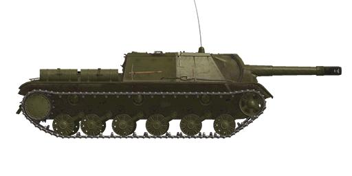

# SU-152 ChKZ (1943)

## Description

SU-152 heavy assault gun has been produced at the Kirov tank factory in Chelyabinsk (ChKZ) from February 1943 till January 1944. 670 units were produced in total.   
  
The assault gun was built on KV-1s tank chassis, so its engine compartment remained the same while the fighting and driving compartments were new. It had only one weapon installed - 152mm ML-20 all-purpose gun. The crew compartment was wider than the hull but was armored good enough. Its array of aiming instruments included the telescopic gunsight for direct fire, gunner's panoramic gunsight with an independent line of sight and PTK-5 panoramic visor for the commander.  
  
During the Kursk battle, SU-152 was the only Soviet armoured vehicle capable of engaging the newest German heavy tanks at 1.5-2 km distances.  
  
<b><u>Unladen weight:</u></b> 45500 kg.  
Length: 8.7 m.  
Width: 3.3 m.  
Height: 2.3 m.  
Clearance: 440 mm.  
  
Engine: В-2К, diesel.  
Maximum power: 600 HP at 2000 RPM.  
Maximum RPM: 2150 RPM.  
4 speed gearbox with 2 stage demultiplier.  
  
<b><u>Maximum road speed:</u></b>  
1-st low: 4.5 kph.  
2-st low: 6.6 kph.  
3-st low: 9.3 kph.  
4-st low: 12.9 kph.  
1-st high: 16.0 kph.  
2-st high: 23.1 kph.  
3-st high: 33.0 kph.  
4-st high: 45.4 kph.  
Reverse low: 5.0 kph.  
Reverse high: 17.9 kph.  
  
<b><u>Maximum offroad speed:</u></b> 24 kph.  
  
<b><u>Endurance range:</u></b> 200 km.  
  
<b><u>Fluids:</u></b>  
Internal fuel tanks capacity: 545 l.  
External fuel tanks capacity: 280 l.  
Engine oil system capacity: 100 l.  
Summer engine coolant: 150 l. of water  
Winter engine coolant: 150 l. of 67% ethylene-glycol  
Maximum oil consumption: 11 l/h.  
  
<b><u>Hull armour:</u></b>  
Gun mantlet: 60-70 mm cast armour.  
Upper front: 75 mm rolled armour.  
Middle front: 50 mm rolled armour.  
Lower front: 60 mm rolled armour.  
Sides: 60 mm rolled armour.  
Rear: 60 mm rolled armour.  
Frontal roof: 20 mm rolled armour.  
Rear roof: 30 mm rolled armour.  
Bottom: 30 mm rolled armour.  
Bottom above tracks: 25 mm rolled armour.  
  
<b><u>Main gun:</u></b> rifled, 152 mm ML-20S, separate loading.  
Barrel length: 22.8.  
Elevation: +18°..-3°.  
Azimuth: +7°..-7°.  
Ammo: up to 20 rounds.  
Usable rate of fire: 2.4 rounds per minute.  
Turret drive: mechanical.  
  
<b><u>Gun ammunition:</u></b>   
  
OF-540 high explosive (HE): 43.56 kg, 655 m/s, 6.25 kg explosives.  
Gunsight settings  
(Distance - mils scale):  
00000m - 000  
00200m - 002    04200m - 059    08200m - 154  
00400m - 004    04400m - 063    08400m - 160  
00600m - 007    04600m - 067    08600m - 167  
00800m - 009    04800m - 071    08800m - 173  
01000m - 012    05000m - 075    09000m - 180  
  
01200m - 014    05200m - 079    09200m - 187  
01400m - 017    05400m - 083    09400m - 195  
01600m - 020    05600m - 087    09600m - 203  
01800m - 022    05800m - 092    09800m - 210  
02000m - 025    06000m - 096    10000m - 218  
  
02200m - 027    06200m - 101    10200m - 226  
02400m - 030    06400m - 105    10400m - 234  
02600m - 033    06600m - 110    10600m - 242  
02800m - 036    06800m - 115    10800m - 251  
03000m - 039    07000m - 120    11000m - 259  
  
03200m - 042    07200m - 125    11200m - 267  
03400m - 045    07400m - 131    11400m - 276  
03600m - 048    07600m - 137    11600m - 285  
03800m - 052    07800m - 142    11800m - 294  
04000m - 055    08000m - 148    12000m - 303  
  
BR-540 armour piercing high explosive (APHE): 48.78 kg, 600 m/s, 1.2 kg explosives.  
Gunsight settings  
(Distance - mils scale):  
0000m - 00  
0100m - 02    1100m - 16  
0200m - 03    1200m - 17  
0300m - 04    1300m - 19  
0400m - 06    1400m - 20  
0500m - 07    1500m - 22  
0600m - 09    1600m - 23  
0700m - 10    1700m - 24  
0800m - 11    1800m - 26  
0900m - 13    1900m - 28  
1000m - 14    2000m - 29  
  
<b><u>Gunsights:</u></b>  
ST-10 gunner scope-sight, field of view 18°.  
PG gunner panoramic periscopic sight, field of view 10.5°, allows indirect fire.  
PTK commander panoramic periscopic sight, field of view 26°.  
  
<b><u>Radio equipment:</u></b>  
VHF 9-RM transceiver.  
3 intercom terminals.

## Modifications

**High-Explosive Shells**  
OF-540  
  
Good against soft, unarmoured or lightly armoured targets.  
  
Mass 43.56 kg, explosives mass 6.25 kg.  
Direct hit armour penetration 60 mm, effective damage distance for light vehicles 8 m.  
  
When fired from a ML-20S gun:  
Muzzle velocity: 655 m/s.  
500 m: velocity: 630 m/s, drop -3.0 m.  
1000 m: velocity: 605 m/s, drop -12.4 m.  
2000 m: velocity: 560 m/s, drop -51.6 m.

**Armour Piercing High Explosive Shells**  
BR-540  
  
Shells armed with bursting charge warhead.  
Good against armoured targets. In case of penetration do more damage inside the target than solid AP shells, but HE filling can detonate prematurely (for instance, when used against spaced armour plates).  
  
Mass 48.78 kg, explosives mass 1.2 kg.  
  
When fired from a ML-20S gun:  
Muzzle velocity 600 m/s, armour penetration at point blank range 138 mm.  
500 m: armour penetration 131 mm, velocity 578 m/s, drop -3.7 m.  
1000 m: armour penetration 124 mm, velocity 557 m/s, drop -14.7 m.  
2000 m: armour penetration 111 mm, velocity 516 m/s, drop -60.1 m.

**Removed Fuel Tank**  
The external rear-mounted fuel tank was commonly removed on the Eastern front.
