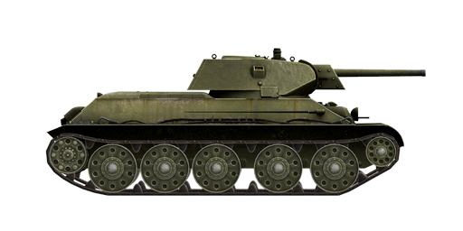

# T-34/76 STZ (1942)

## Description

T-34 with 76 mm F-34 main gun built at Stalingrad Tractor Factory (STZ), Summer 1942, with welded turret that was shipped from factory 264. The main feature of STZ tanks built in this timeframe is the turret with cut bottom-front edges, straight gun mantlet and cast wheels with internal dampeners.  
  
The production at STZ continued until the very last moment: it stopped completely and the remaining workers were evacuated on October 5th, 1942, when the German forces almost reached the factory buildings.  
  
<b><u>Unladen weight:</u></b> ~29000 kg.  
Length: 6.6 m.  
Width: 3.0 m.  
Height: 2.4 m.  
Clearance: 400 mm.  
  
Engine: V-2 diesel.  
Maximum power: 500 HP at 1800 RPM.  
Maximum RPM: 1900 RPM.  
4 speed gearbox.  
  
<b><u>Maximum road speed:</u></b>  
1-st: 8.3 kph.  
2-st: 17.3 kph.  
3-st: 28.6 kph.  
4-st: 54.0 kph.  
Reverse: 7.7 kph.  
  
<b><u>Maximum offroad speed:</u></b> 36 kph.  
  
<b><u>Fluids:</u></b>  
Internal fuel tanks capacity: 460 l.  
Engine oil system capacity: 80 l.  
Summer engine coolant: 95 l. of water  
Winter engine coolant: 95 l. of 50%25 ethylene-glycol  
Endurance range: 300 km.  
Maximum oil consumption: 9 l/h.  
  
<b><u>Hull armour:</u></b>  
Front: 45 mm.  
Upper sides: 40 mm rolled armour.  
Lower sides: 45 mm rolled armour.  
Rear: 40 mm rolled armour.  
Roof: 16 mm rolled armour.  
Bottom: 13..16 mm rolled armour.  
Bottom above tracks: 13 mm rolled armour.  
  
<b><u>Turret armour:</u></b>  
Front: 45 mm rolled armour.  
Sides: 45 mm rolled armour.  
Rear: 45 mm rolled armour.  
Roof: 15 mm rolled armour.  
Gun mantlet: 20..45 mm rolled armour.  
  
<b><u>Main gun:</u></b> rifled, 76.2 mm F-34.  
Barrel length: 41.6.  
Elevation: +25°..-5°.  
Ammo: up to 77 rounds.  
Usable rate of fire: 8 rounds per minute.  
Turret drive: electric, 14 seconds per rotation.  
  
<b><u>Gun ammunition:</u></b>  
BR-350B armour piercing high explosive (APHE): 6.5 kg, 660 m/s, 72 mm at 500 m.  
BR-350BSP armor piercing solid (AP): 6.6 kg, 660 m/s, 73 mm at 500 m.  
BR-354P armour piercing composite rigid (APCR): 3.02 kg, 950 m/s, 129 mm point blank.  
OF-350 high explosive (HE): 6.2 kg, 680 m/s, 710 g. explosives.  
  
<b><u>Machineguns:</u></b> 7.62 mm Degtyarev (DT).  
Bullet mass: 9.8 g.  
Muzzle velocity: 840 m/s.  
Armour pentration at 100 m: 11 mm.  
Rate of fire: 600 rounds per minute.  
Coaxial: 46 mags, 63 rounds per each (2898 rounds).  
Bow: not implemented.  
  
<b><u>Gunsights:</u></b>  
TMFD-7 gunner scope-sight, field of view 15°.  
  
<b><u>Radio equipment:</u></b>  
VHF 9-RM transceiver.  
  
  
<b><u>ATTENTION:</u></b>  
This tank is free to any IL-2 Great Battles user. 'Tank Crew' expansion tanks have siginficantly more detailed exterior and interior of the crew stations.

## Modifications

**High-Explosive Shells**  
OF-350  
  
Good against soft, unarmoured or lightly armoured targets.  
  
Mass 6.2 kg, explosives mass 710 g.  
Direct hit armour penetration 20 mm, effective damage distance for light vehicles 3 m.  
  
When fired from a F-34 / ZiS-5 gun:  
Muzzle velocity: 680 m/s.  
500 m: velocity: 616 m/s, drop -3.0 m.  
1000 m: velocity: 558 m/s, drop -12.5 m.  
2000 m: velocity: 468 m/s, drop -56.7 m.

**Armour Piercing Shells**  
BR-350BSP  
  
Solid armour piercing shells without explosive filling.  
Good against spaced armour plates, but cause less damage inside a target than more advanced APHE.  
  
Mass: 6.6 kg.  
  
When fired from a F-34 / ZiS-5 gun:  
Muzzle velocity 660 m/s, armour penetration at point blank range 87 mm.  
500 m: armour penetration 73 mm, velocity 585 m/s, drop -3.2 m.  
1000 m: armour penetration 62 mm, velocity 524 m/s, drop -13.6 m.  
2000 m: armour penetration 47 mm, velocity 429 m/s, drop -63.5 m.

**Armour Piercing High Explosive Shells**  
BR-350B  
  
Shells armed with bursting charge warhead.  
Good against armoured targets. In case of penetration do more damage inside the target than solid AP shells, but HE filling can detonate prematurely (for instance, when used against spaced armour plates).  
  
Mass 6.5 kg, explosives mass 119 g.  
  
When fired from a F-34 / ZiS-5 gun:  
Muzzle velocity 660 m/s, armour penetration at point blank range 86 mm.  
500 m: armour penetration 72 mm, velocity 584 m/s, drop -3.2 m.  
1000 m: armour penetration 61 mm, velocity 522 m/s, drop -13.6 m.  
2000 m: armour penetration 46 mm, velocity 427 m/s, drop -64.0 m.

**Sub-Caliber Armour Piercing Shells**  
BR-354P  
  
Shells armed with sub-caliber armour-piercing projectile.  
  
Good against heavily armoured targets at short ranges: being much lighter than ordinary rounds, they have much higher muzzle velocity and armour penetration at close distances. However, because of the lower mass their velocity quickly diminishes with distance and they are worse than ordinary rounds at higher distances.  
  
The penetrator is held in the barrel by a spool looking sabot. While reducing the round mass for increased muzzle velocity, this makes it lose velocity even more quickly because of the air drag.  
  
Mass: 3.02 kg, penetrator calibre 28 mm.  
  
When fired from a F-34 / ZiS-5 gun:  
Muzzle velocity 950 m/s, armour penetration at point blank range 129 mm.  
500 m: armour penetration 90 mm, velocity 741 m/s, drop -1.7 m.  
1000 m: armour penetration 60 mm, velocity: 558 m/s, drop -8.0 m.  
2000 m: armour penetration 24 mm, velocity: 295 m/s, drop -53.3 m.
